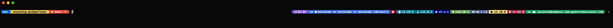
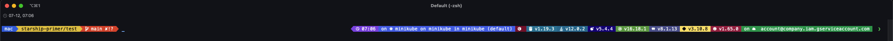
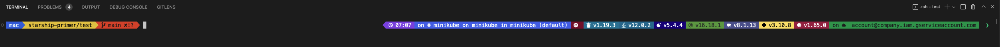
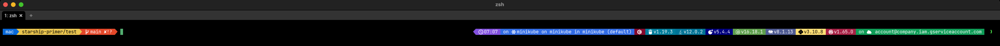

# [WIP] Starship Primer

## Introduction

A configuration preset for [Starship](https://github.com/starship/starship).

- Colors are copied from [Primer Light Theme](https://primer.style/primitives/colors).
- Programming language/tools background colors are the official color of each one.
- The left column contains only: `username`, `directory`, `git_branch`, `git_status`. The remaining ones are in the right column.

## Supported languages/tools/configurations

- Username.
- Git.
- Time.
- Languages and tools:
  - C.
  - Kubernetes.
  - Google Cloud.
  - Go.
  - Java.
  - Lua.
  - NodeJS.
  - PHP.
  - Python.
  - Rust.
- Command duration.
- Character.

Reference documentation: https://starship.rs/config/.

## Supported Terminals

Below is the list of tested environment

| OS    | Terminal                                                          | Supported?     | Tested Environment               |
| ----- | ----------------------------------------------------------------- | -------------- | -------------------------------- |
| macOS | [VSCode Integrated Terminal](https://github.com/microsoft/vscode) | ✅ (partially) | VSCode v1.73.1                   |
| macOS | [Alacritty](https://github.com/alacritty/alacritty)               | ✅             | Alacritty v0.11.0                |
| macOS | [iTerm2](https://github.com/gnachman/iTerm2)                      | ✅             | iTerm2 v3.4.18                   |
| macOS | [WezTerm](https://github.com/wez/wezterm)                         | ✅             | WezTerm 20221119-145034-49b9839f |

## Screenshots

Alacritty



iTerm2


VSCode


WezTerm



## How to contribute?

- This project needs your help to add more configurations for missing programming languages and tools.

- Recommended steps:

  - Fork this project

    ```
    git clone git@github.com:ansidev/starship-primer.git
    ```

  - Modify configurations in [starship.toml](./starship.toml).
    - Color hex code should uses `lowercase`.
    - Text color should be `#ffffff` or `#000000` depending on the background color.
  - Add test files corresponding to the configurations.
  - Open the terminal and change the working directory to this project's root directory.
  - Run the below command to switch to the local Starship config temporarily for testing purposes (closing the terminal will restore your own Starship config).
    ```
    source test.sh
    ```
  - The terminal working directory will be changed to `test` automatically after running the above command. You just need to check whether everything works well.
  - If everything is OK:
    - Add the supported languages/tools/configurations, and tested environment to [README.md](./README.md).
    - Update screenshot(s) to `screenshots` for each tested environment.
  - Commit and push changes to your repository.
  - Create a PR (you should create 1 PR per programming language/tool/configuration).

## Contact

Le Minh Tri [@ansidev](https://ansidev.xyz/about).

## License

This source code is available under the [AGPL-3.0 LICENSE](/LICENSE).
